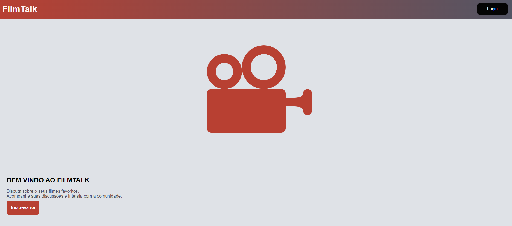

&#xa0;

<h1 align='center'>MyHO</h1>

<a href='#dart-sobre'>Sobre</a> &#xa0; | &#xa0;
<a href='#sparkles-funcionalidades'>Planejamento</a> &#xa0; | &#xa0;
<a href='#memo-licença'>Licença</a> &#xa0; | &#xa0;

 

## :dart: Sobre ##

  O MyHO (my honest opinion) foi desenvolvido com o objetivo de criar um espaço online onde entusiastas de cinema podem se reunir, discutir seus filmes favoritos, recomendar novas descobertas e compartilhar insights.

  O design do projeto foi proposto como sendo da seguinte maneira: <a href="https://www.figma.com/file/qr6CObffx3WshklRZJNhxA/MyHO?type=design&node-id=0%3A1&mode=design&t=KPYvb7nQ9y6afTWW-1">Design no Figma</a>, tendo como prioridade de desenvolvimento o mobile first com ajustes de responsividade para telas maiores após a conclusão das funcionalidades iniciais.

### Recursos Principais:

- Discussões Temáticas: Crie e participe de discussões sobre uma variedade de tópicos relacionados a filmes, desde clássicos cult até lançamentos mais recentes.

- Avaliações e Críticas: Compartilhe suas opiniões sobre filmes, dando avaliações e críticas que podem ajudar outros usuários a decidir o que assistir a seguir.

### Recursos a serem pensados:

- Listas de favoritos: Crie listas com seus filmes favoritos e adicione ao seu perfil.

- Notícias e Atualizações: Mantenha-se atualizado com as últimas notícias da indústria cinematográfica e descubra eventos importantes relacionados ao cinema.

## :sparkles: Planejamento ##

- [ ] Sistema de Registro/login funcional; 
- [ ] Página inicial de postagens do forum; 
- [ ] Página de usuário para criação e visualização de suas postagens; 

## :memo: Licença ##

Este projeto está sob licença MIT. Veja o arquivo [LICENSE](LICENSE.md) para mais detalhes.
